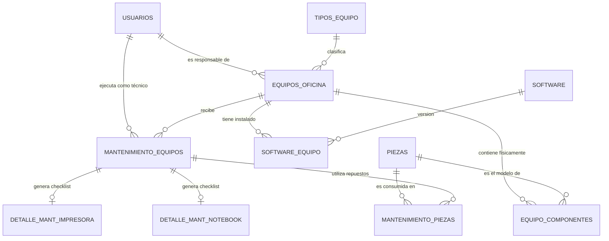

# 🗄️ Modelo de Base de Datos (MySQL)

El ecosistema de **Hirata Transporte** opera sobre una base de datos relacional normalizada. El sistema se divide en dos grandes áreas operativas: la gestión de la flota de camiones (Etapa 1) y el control de activos informáticos (Etapa 2). 

A continuación se detalla la arquitectura de datos correspondiente al módulo de **Mantenimiento de Equipos de Oficina e Inventario**.

## 🗺️ Diagrama Entidad-Relación (ER)

El siguiente diagrama ilustra cómo se relacionan los equipos de oficina con los usuarios, el inventario de piezas, el catálogo de software y los registros de mantenimiento.


## 📖 Diccionario de Datos Principal

### 1. Gestión de Activos (```equipos_oficina```)

Tabla central que almacena el registro de los activos informáticos (Notebooks, PCs, Impresoras y Celulares).

| Columna | Tipo de Dato | Restricción / Relación | Descripción |
|---------|--------------|------------------------|-------------|
| id_equipo | INT | PK, AUTO_INCREMENT | Identificador único del activo. |
| id_tipo_equipo | INT | FK -> tipos_equipo | Referencia al tipo de hardware. |
| marca / modelo | VARCHAR(50) | NOT NULL | Especificación técnica. |
| numero_serie | VARCHAR(100) | UNIQUE, NOT NULL | Número de serie físico. |
| estado | ENUM | DEFAULT 'Activo' | Activo, Inactivo o En Mantenimiento. |
| id_responsable | INT | FK -> usuarios | Empleado a cargo del equipo. |

---
###  2. Historial de Mantenimiento (```mantenimiento_equipos```)
Almacena el registro de intervenciones técnicas, cumpliendo con el requerimiento de trazabilidad.

| Columna | Tipo de Dato | Restricción / Relación | Descripción |
|---------|--------------|------------------------|-------------|
| id_mantenimiento | INT | PK, AUTO_INCREMENT | Código único de intervención. |
| id_equipo | INT | FK -> equipos_oficina | Relación con el equipo afectado. |
| tipo_mantenimiento | ENUM | DEFAULT 'Preventivo' | Preventivo o Correctivo. |
| estado | ENUM | DEFAULT 'Programado' | Programado, En Proceso, Completado, Cancelado. |
| id_tecnico | INT | FK -> usuarios | Técnico de IT que realizó el trabajo. |
| fecha_inicio | DATETIME | | Cuándo inició el trabajo. |

---

### 3. Control de Bodega (```piezas```)
Gestiona el stock de repuestos de hardware disponibles en la organización.

| Columna | Tipo de Dato | Restricción / Relación | Descripción |
|---------|--------------|------------------------|-------------|
| id_pieza | INT | PK, AUTO_INCREMENT | Código del componente. |
| id_tipo_pieza | INT | FK -> tipos_pieza | Categoría (RAM, HDD, CPU, etc). |
| stock_actual | INT | NOT NULL, DEFAULT 0 | Cantidad disponible en bodega. |
| stock_minimo | INT | NOT NULL, DEFAULT 1 | Umbral para alertas de reposición. |

---

### 4. Control de Software (```software_equipo```)
Lleva el seguimiento de las instalaciones y actualizaciones de programas por equipo.

| Columna | Tipo de Dato | Restricción / Relación | Descripción |
|---------|--------------|------------------------|-------------|
| id_sw_equipo | INT | PK, AUTO_INCREMENT | Registro único de instalación. |
| id_equipo | INT | FK -> equipos_oficina | Equipo objetivo. |
| id_software | INT | FK -> software | Programa instalado. |
| version | VARCHAR(50) | NOT NULL | Versión exacta (Ej: 22H2, 7.6.0). |
| estado | ENUM | DEFAULT 'Instalado' | Instalado, Actualizado, Desinstalado. |

---

# ✅ Sistema de Checklists Dinámicos
Para garantizar la calidad del servicio, el sistema utiliza tablas independientes vinculadas ``` 1:1 ``` al ``` id_mantenimiento ``` según el tipo de equipo. Por ejemplo, la tabla ``` detalle_mant_notebook  ```exige verificar el desarmado, cambio de pasta térmica y check de RAM, mientras que ``` detalle_mant_impresora ``` exige calibración de cabezales y revisión de rodillos.

