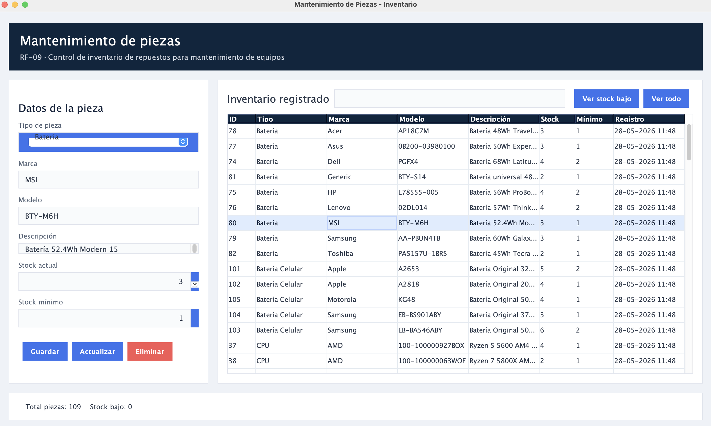
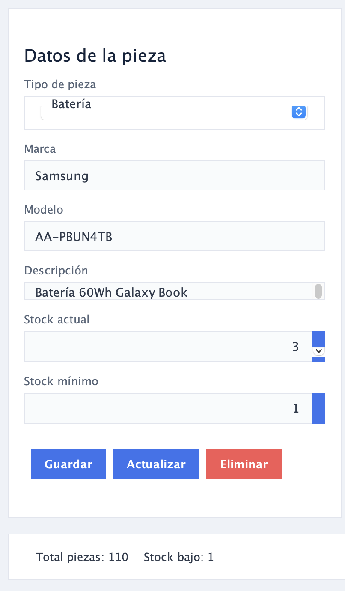
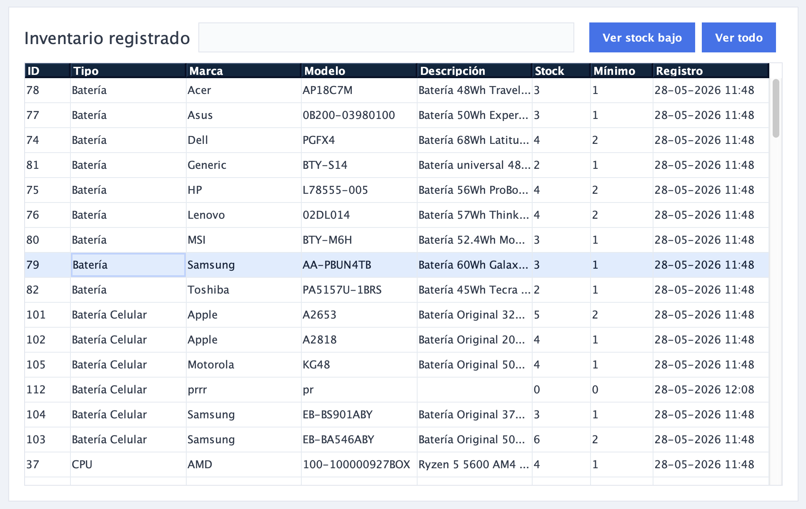

# Módulo de Control de Inventario

## Descripción General

El módulo de Mantenimiento de Piezas (RF-09) permite gestionar el stock de repuestos para la reparación de equipos, asegurando un control eficiente de los componentes disponibles en el taller.

---

## Interfaz Principal

La pantalla se divide en dos secciones principales:

{ style="border: 1px solid #e5e7eb; border-radius: 8px; box-shadow: 0 4px 6px rgba(0,0,0,0.05);" }

### Panel de Datos (Izquierda)
Formulario para ingresar, editar o eliminar información de una pieza.

{ style="border: 1px solid #e5e7eb; border-radius: 8px; box-shadow: 0 4px 6px rgba(0,0,0,0.05);" }

### Inventario Registrado (Derecha)

Tabla con todos los componentes, permitiendo búsquedas rápidas, filtrado por "Stock bajo" o visualización total.

{ style="border: 1px solid #e5e7eb; border-radius: 8px; box-shadow: 0 4px 6px rgba(0,0,0,0.05);" }

---

## Flujo de Trabajo

### A. Registrar una nueva pieza

Para dar de alta un componente en el inventario:

1. Utiliza el menú desplegable (ComboBox) de **"Tipo de pieza"** para clasificar el ítem.
2. Completa manualmente los campos de **Marca**, **Modelo**, **Descripción**, **Stock actual** y **Stock mínimo**.
3. Haz clic en el botón **Guardar**.

### B. Buscar, Editar o Eliminar una pieza

Para localizar un ítem y modificarlo, puedes usar dos métodos:

#### Búsqueda rápida
Escribe en la barra de búsqueda situada sobre la tabla para filtrar los resultados.

#### Selección directa
Haz clic directamente sobre la fila deseada en la tabla. Al hacerlo, los campos del Panel de Datos se cargarán automáticamente con la información del componente seleccionado.

**Para editar**: Realiza los cambios necesarios en los campos y presiona el botón **Actualizar**.

**Para eliminar**: Presiona el botón **Eliminar** para retirar la pieza del inventario.

---