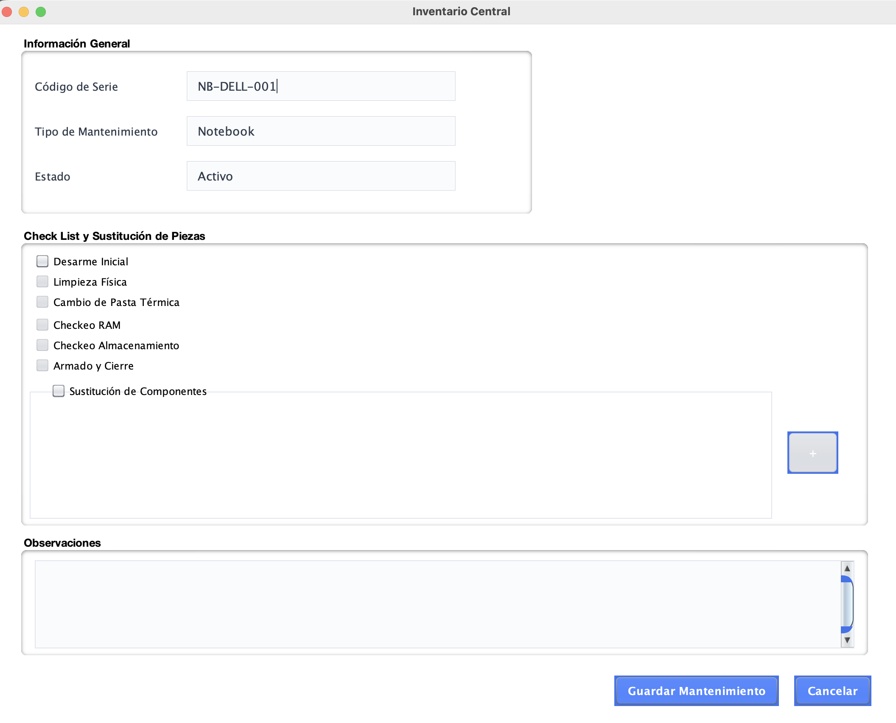
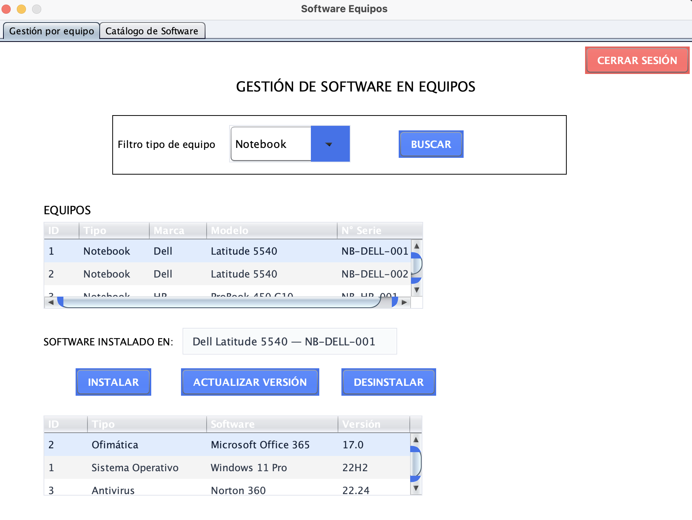
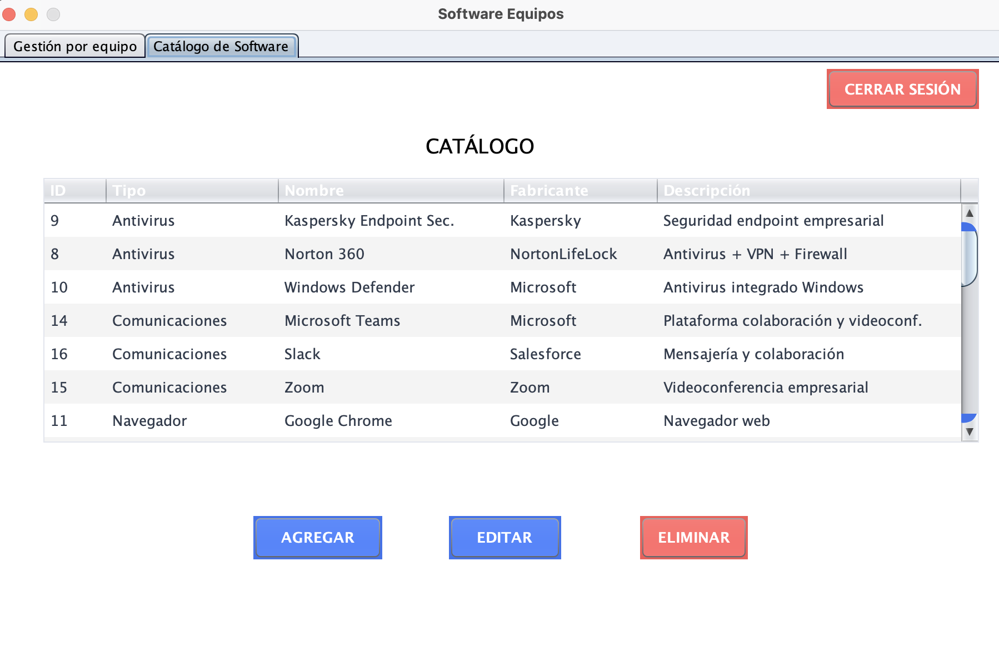
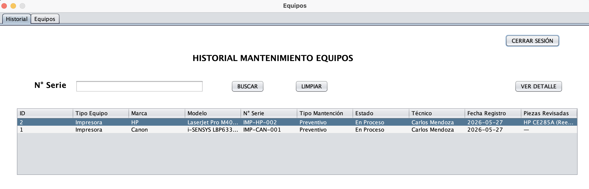
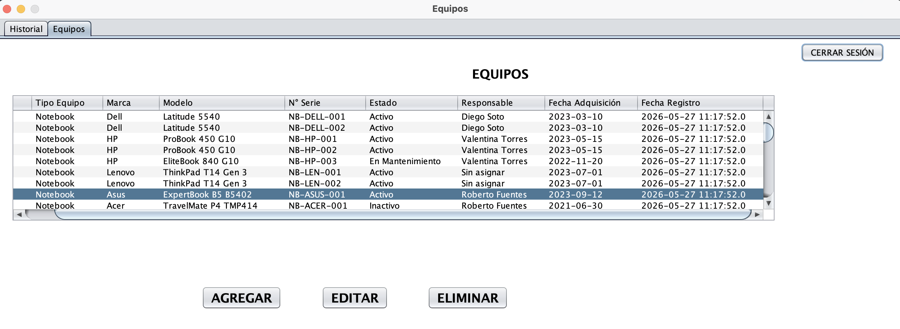

# 🛠️ Manual de Registro de Mantenimientos

Este módulo permite a los técnicos y administradores gestionar el ciclo de vida operativo de los equipos de oficina, registrando intervenciones preventivas, correctivas y actualizaciones de software.

---

## 📝 1. Registrar un Nuevo Mantenimiento (RF-06)

Para ingresar una nueva intervención técnica en el sistema, acceda a la ventana de Mantenimiento y complete los siguientes tres paneles:

### A. Información General
Este panel identifica el equipo y el tipo de trabajo a realizar.
* **Código de Serie:** Ingrese el identificador único del equipo a intervenir (ej. `NB-DELL-001`).
* **Tipo de Mantenimiento:** Indique si el trabajo es de carácter **Preventivo** o **Correctivo**.
* **Estado:** Seleccione el estado actual de la intervención (ej. *Programado*, *En Proceso*, *Completado*).

### B. Check List y Sustitución de Piezas
Aquí debe marcar todas las tareas físicas realizadas sobre el hardware. Las opciones disponibles son:

* [x] Desarme Inicial
* [x] Limpieza Física
* [x] Cambio de Pasta Térmica
* [x] Checkeo RAM
* [x] Checkeo Almacenamiento
* [x] Armado y Cierre

**Sustitución de Componentes:** Si el mantenimiento requirió cambiar una pieza (ej. disco duro malo), marque la casilla **"Sustitución de Componentes"**. Esto habilitará el panel inferior donde podrá usar el botón **` + `** (Agregar) para descontar el repuesto directamente del inventario.

### C. Observaciones
Utilice el cuadro de texto libre para detallar cualquier anomalía encontrada durante la limpieza o si el equipo presenta daños estéticos.

### Finalizar
Una vez completados los paneles, haga clic en el botón gris **`Guardar Mantenimiento`** para registrar la intervención en la base de datos, o presione **`Cancelar`** para limpiar el formulario.

{ style="border: 1px solid #e5e7eb; border-radius: 8px; box-shadow: 0 4px 6px rgba(0,0,0,0.05);" }
---

## 💻 2. Gestión y Actualización de Software (RF-07)

Este módulo permite controlar el ciclo de vida de las aplicaciones instaladas, manteniendo el control de versiones y licenciamiento. La interfaz se divide en dos pestañas principales:

### A. Pestaña: Gestión por Equipo
Esta es la vista operativa para revisar qué tiene instalado cada dispositivo:

1. **Filtrar Equipos:** En el panel superior, utilice el **"Filtro tipo de equipo"** (ej. *Notebooks*, *PC Escritorio*, *Celulares*) y presione el botón **`BUSCAR`**.
2. **Seleccionar Equipo:** La tabla superior ("EQUIPOS") mostrará los dispositivos que coinciden con la búsqueda. Al hacer clic sobre una fila, la tabla inferior se actualizará automáticamente mostrando todo el **Software Instalado** en ese equipo específico.
3. **Acciones de Software:** Seleccione un programa de la tabla inferior y utilice los botones centrales para operar:
   * **`INSTALAR`**: Asigna un nuevo programa al equipo.
   * **`ACTUALIZAR VERSIÓN`**: Abre una ventana emergente con el detalle de la actualización. Deberá completar la siguiente información para mantener la trazabilidad:
      * **Software / Versión Actual:** Muestra los datos actuales del programa seleccionado.
      * **Nueva Versión:** Ingrese el número o código de la actualización instalada (ej. *23H2*).
      * **Técnico:** Seleccione su nombre en la lista desplegable como responsable de la intervención.
      * **Notas:** Añada observaciones relevantes, como si el software requirió un reinicio o si hubo conflictos previos.
      * Presione **`GUARDAR`** para confirmar el cambio o **`CANCELAR`** para cerrar la ventana.
   * **`DESINSTALAR`**: Registra la baja del software en ese hardware.

 
{ style="border: 1px solid #e5e7eb; border-radius: 8px; box-shadow: 0 4px 6px rgba(0,0,0,0.05);" }
 

### B. Pestaña: Catálogo de Software
Contiene la lista maestra de todos los programas autorizados por la empresa (ej. *Windows 11*, *Office 365*). Desde aquí, el administrador puede **`AGREGAR`**, **`EDITAR`** o **`ELIMINAR`** el software base que luego estará disponible para ser instalado en los equipos.

{ style="border: 1px solid #e5e7eb; border-radius: 8px; box-shadow: 0 4px 6px rgba(0,0,0,0.05);" }

---

## 📊 3. Historial y Gestión de Equipos (RF-06 y RF-08)

Este módulo centraliza la administración física de los dispositivos y el registro histórico de sus intervenciones técnicas. La interfaz se divide en dos áreas operativas:

### A. Pestaña: Historial
Diseñada para la auditoría y trazabilidad de los trabajos de mantenimiento realizados en la organización.

1. Ingrese a la pestaña **Historial**.
2. Utilice el buscador superior ingresando el **N° Serie** del equipo y presione el botón **`BUSCAR`**. (Puede usar **`LIMPIAR`** para restablecer la tabla general).
3. El sistema filtrará y desplegará todos los registros asociados a ese hardware.
4. Seleccione un registro específico en la tabla y presione **`VER DETALLE`**. Esto abrirá una vista completa con el checklist exacto que el técnico llenó ese día, las observaciones y los repuestos utilizados.

{ style="border: 1px solid #e5e7eb; border-radius: 8px; box-shadow: 0 4px 6px rgba(0,0,0,0.05);" }

### B. Pestaña: Equipos
Corresponde al inventario físico maestro de la empresa. Desde aquí se gestiona el alta y baja de los activos (hardware).

1. Ingrese a la pestaña **Equipos**.
2. La pantalla principal mostrará una tabla con todos los dispositivos registrados.
3. Utilice los botones inferiores para operar sobre el catálogo:
   * **`AGREGAR`**: Abre el formulario para registrar un nuevo equipo (Notebook, PC de Escritorio, Impresora o Celular) asociándolo a un responsable.
   * **`EDITAR`**: Permite actualizar los datos o cambiar el estado de un equipo previamente seleccionado en la tabla.
   * **`ELIMINAR`**: Da de baja definitivamente un activo del sistema.

{ style="border: 1px solid #e5e7eb; border-radius: 8px; box-shadow: 0 4px 6px rgba(0,0,0,0.05);" }